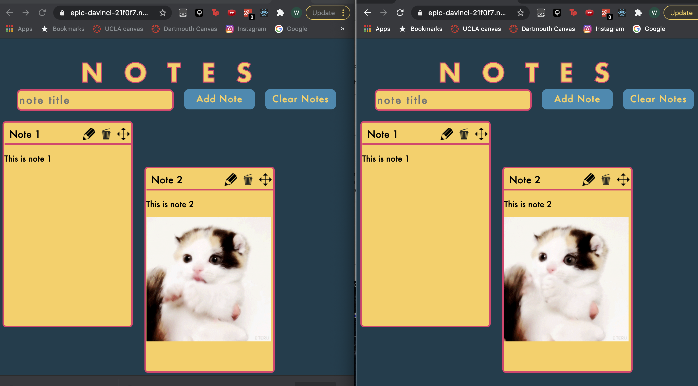

# React Notes

In this assignment, we make a google docs type web app that allows users to collaboratively edit a note board in real time!

[deployed url](https://epic-davinci-21f0f7.netlify.app/)

## What Worked Well

Once I got the hang of React, it was very useful and relatively easy to use. This assignment allowed me to see why React is one of the most popular web dev libraries, as it make it so easy to pass data between components of the app.

## What Didn't

After getting it, using Firebase was relatively straightforward, but it took me a long time to understand how react and the database actually interacted. I also had some cool ideas for extra credit (aside form the ones that I actually did) that, given my current web dev knowledge, were impossible to make work.

## Extra Credit

I did two major things for extra credit:

1) z-index ordering. I did some z-index manipulation such that whichever note is dragged becomes on top (i.e highest z-index). This worked well, but the z-indexes get quite high. My fix for this is that when there are no notes on the board (i.e. all deleted), the max z-index goes to zero.

2) clear all button. If the workspace and number of collaborators get very large, the user can hit 'clear notes', which deletes all notes. I thought this added a lot of practical functionality to the board.

## Screenshots

